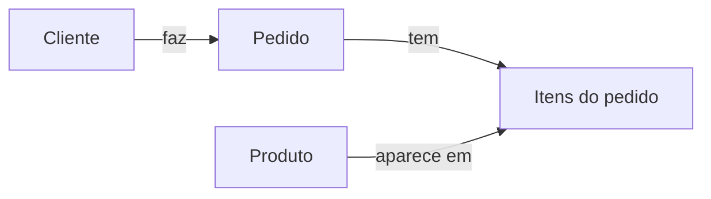
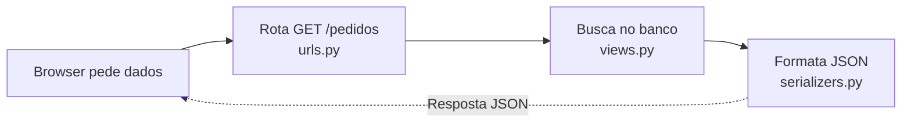

# ORMs - Evitando os erros mais comuns

Como evitar armadilhas ao usar ORMs com Python

---

# O que são ORMs?

### ORM = Object-Relational Mapper: mapeia objetos Python ↔ tabelas/linhas no banco


```python
class Produto(BaseModel):
    url_foto = models.URLField()
    nome = models.CharField(max_length=160)
    descricao = models.TextField()
    valor_unitario = models.DecimalField(
      max_digits=12,
      decimal_places=2,
    )
    ...
```

---
transition: fade
---

# O que são ORMs?


#### Consultas feitas em código Python...

```python
queryset = Produto.objects
  .filter(preco__lte=100).order_by('-data_criacao')

if apenas_este_ano:
  queryset = queryset.filter(
    data_criacao__gte=date(2026, 1, 1)
  )
```
---


# O que são ORMs?

#### ...viram SQL em tempo de execução

```sql
SELECT "id","nome","descricao","preco"
FROM "api_produto"
WHERE ("preco" <= 100
       AND "data_criacao" >= '2026-01-01 00:00:00')
ORDER BY "data_criacao" DESC
```

---
layout: image
image: /005_25-itens.png
backgroundSize: contain
---

---

# Estrutura do nosso sistema



---

# Como funciona Django + DRF

### O fluxo: requisição HTTP → banco → JSON



---

# Os 2 componentes essenciais

#### A view define a consulta ao banco (queryset)

```python {|3|4|0}
# views.py - Busca dados (lazy)
class PedidoListAPIView(ListAPIView):
    queryset = Pedido.objects.order_by("-data_criacao")
    serializer_class = PedidoListSerializer
```
<v-click>

O serializer executa a queryset e formata a resposta como JSON

```python
# serializers.py - Formata JSON
class PedidoListSerializer(serializers.ModelSerializer):
  cliente_nome = serializers.CharField(source="cliente.nome")
  class Meta:
    model = Pedido
    fields = ["id", "num_pedido", "cliente_nome", "status"]
```
</v-click>


---
hide: true
---

# Resultado: JSON estruturado

```json
{
  "results": [
    {
      "id": 1,
      "num_pedido": "XYZ001A",
      "cliente_nome": "João Silva",
      "status": "entregue",
      ...
    },
    {
      "id": 2,
      "num_pedido": "XYZ002B",
      ...
    }
  ],
}
```

---
layout: image
image: /005_25-itens.png
backgroundSize: contain
transition: fade
---

---
layout: image
image: /009_carregando.png
backgroundSize: contain
transition: fade
---

---
layout: image
image: /010_2000-itens.png
backgroundSize: contain
transition: fade
---

---
layout: image
image: /012_silk_4003.png
backgroundSize: contain
transition: fade
---

---
layout: image
image: /013_silk-pairs.png
backgroundSize: contain
---
---
layout: image
image: /image-8.png
backgroundSize: contain
---

---

# O problema N+1:

<Transform :scale="1.18" origin="top left">
  <ul class="mt-8 font-semibold text-left pl-10 leading-tight">
    <li>É feita <span style="color:red">uma</span> consulta para pegar todos pedidos</li>
    <li>E depois <span style="color:red">N consultas extra</span> para dados adicionais de cada pedido</li>
  </ul>
</Transform>

---
class: clientes-table-slide
---

# Vamos resolver o N+1 para clientes

#### No caso de clientes, cada pedido tem 1 cliente. Então podemos resolver trazendo os dados de clientes de cada pedido, junto com os N pedidos

| pedido.id | pedido.data_criacao | <span style="color:green">cliente.id</span> | <span style="color:green">cliente.nome</span> | <span style="color:green">cliente.sobrenome</span> |
| --------- | ------------------- | ---------- | ------------ | ----------------- |
| 9562      | 2025-01-15 10:30    | <span style="color:green">42</span>         | <span style="color:green">Maria</span>        | <span style="color:green">Silva</span>             |
| 8849      | 2025-01-14 16:45    | <span style="color:green">17</span>         | <span style="color:green">João</span>         | <span style="color:green">Santos</span>            |


---

# Fazendo um JOIN

#### No Django isso se resolve com um `select_related`

<div class="mt-8 mx-auto max-w-4xl text-left">

````md magic-move
```python{|6}
class PedidoListAPIView(generics.ListAPIView):
  serializer_class = PedidoListSerializer
  ...

  def get_queryset(self):
    queryset = Pedido.objects.order_by("-data_criacao")
```
```python{6-8}
class PedidoListAPIView(generics.ListAPIView):
  serializer_class = PedidoListSerializer
  ...

  def get_queryset(self):
    queryset = Pedido.objects
      .select_related("cliente")
      .order_by("-data_criacao")
```
````

  </div>

---

# Vamos resolver o N+1 para itens_pedido

```sql
SELECT
  SUM(
    api_itempedido.valor_unitario * api_itempedido.quantidade
  ) AS total
FROM
  api_itempedido
WHERE
  api_itempedido.pedido_id = 6605;
```

---

# Cada pedido pode ter 1 ou mais itens

Para os itens de cada pedido, temos vários itens por pedido, não dá pra trazer na mesma linha

<div class="tabelas-lado-a-lado">
<div class="tabela-slide">

<table>
<thead><tr><th>id</th><th>data_criacao</th></tr></thead>
<tbody>
<tr class="linha-9562"><td>9562</td><td>2025-01-15 10:30</td></tr>
<tr class="linha-7201"><td>7201</td><td>2025-01-14 16:45</td></tr>
</tbody>
</table>

</div>
<div class="tabela-slide">

<table>
<thead><tr><th>id</th><th>pedido_id</th><th>prod_id</th><th>qtd</th><th>valor</th></tr></thead>
<tbody>
<tr class="linha-9562"><td>101</td><td>9562</td><td>11</td><td>2</td><td>29.90</td></tr>
<tr class="linha-9562"><td>102</td><td>9562</td><td>54</td><td>1</td><td>15.00</td></tr>
<tr class="linha-9562"><td>103</td><td>9562</td><td>23</td><td>3</td><td>9.50</td></tr>
<tr class="linha-7201"><td>201</td><td>7201</td><td>99</td><td>1</td><td>42.00</td></tr>
<tr class="linha-7201"><td>202</td><td>7201</td><td>45</td><td>2</td><td>18.50</td></tr>
</tbody>
</table>

</div>
</div>

---

# prefetch_related

````md magic-move
```python
class PedidoListAPIView(generics.ListAPIView):
    def get_queryset(self):
        queryset = Pedido.objects
          .order_by("-data_criacao")
          .select_related("cliente")
```

```python
class PedidoListAPIView(generics.ListAPIView):
    def get_queryset(self):
        queryset = Pedido.objects
          .order_by("-data_criacao")
          .select_related("cliente")
          .prefetch_related("")
```
````
