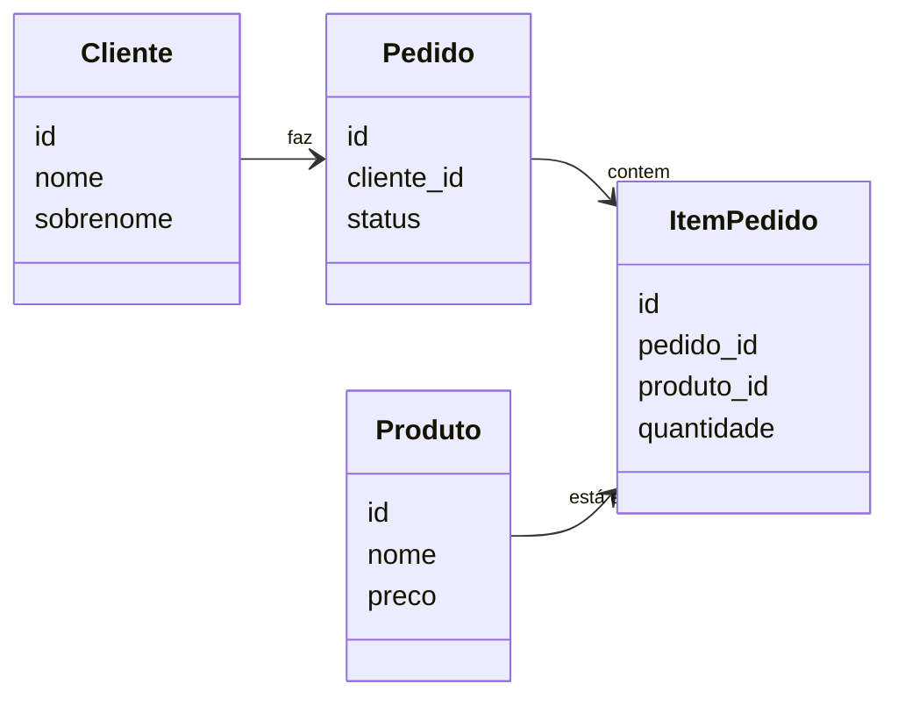

# ORMs - Evitando os erros mais comuns

Como evitar armadilhas ao usar ORMs com Python

---

# O que são ORMs?

### ORM = Object-Relational Mapper: mapeia objetos Python ↔ tabelas/linhas no banco


```python
class Produto(BaseModel):
    url_foto = models.URLField()
    nome = models.CharField(max_length=160)
    descricao = models.TextField()
    valor_unitario = models.DecimalField(
      max_digits=12,
      decimal_places=2,
    )
    ...
```

---

# O que são ORMs?


#### Consultas feitas em código Python...


```python
Produto.objects.filter(
  preco__lte=100,
  data_criacao__gte=date(2026, 1, 1)
).order_by('-data_criacao')
```

<v-click>

...viram código SQL em tempo de execução, automaticamente

```sql
SELECT "id","nome","descricao","preco"
FROM "api_produto"
WHERE ("preco" <= 100
       AND "data_criacao" >= '2026-01-01 00:00:00')
ORDER BY "data_criacao" DESC
```

</v-click>

---

# Por que ORMs são úteis?

```python
@transaction.atomic
def criar_pedido(cliente, itens):
  pedido = Pedido.objects.create(cliente=cliente, status="aberto")

  for item in itens:
    produto = Produto.objects
      .select_for_update()
      .get(id=item["produto_id"])

    ItemPedido.objects.create(
      pedido=pedido, produto=produto, quantidade=item["quantidade"],
    )

    produto.update(num_estoque=F("num_estoque") - item["quantidade"])
```

---
layout: image
image: /image-1.png
backgroundSize: contain
transition: fade
---

---

# Estrutura do nosso sistema



---

# Como funciona Django + DRF

### O fluxo: requisição HTTP → banco → JSON

```
GET /api/pedidos/  (Browser)
    ↓
urls.py (registra rota)
    ↓
view.py (busca dados no BD)
    ↓
serializer.py (formata em JSON)
    ↓
Response JSON
```

---

# Os 3 componentes essenciais

```python
# urls.py - Define rota
path("pedidos/", PedidoListAPIView.as_view())
```
<v-click>

```python {|3|4}
# views.py - Busca dados (lazy)
class PedidoListAPIView(ListAPIView):
    queryset = Pedido.objects.order_by("-data_criacao")
    serializer_class = PedidoListSerializer
```
</v-click>

<v-click>

```python
# serializers.py - Formata JSON
class PedidoListSerializer(serializers.ModelSerializer):
    cliente_nome = serializers.CharField(source="cliente.nome")
    class Meta:
        model = Pedido
        fields = ["id", "num_pedido", "cliente_nome", "status"]
```
</v-click>


---

# Resultado: JSON estruturado

```json
{
  "results": [
    {
      "id": 1,
      "num_pedido": "XYZ001A",
      "cliente_nome": "João Silva",
      "status": "entregue",
      ...
    },
    {
      "id": 2,
      "num_pedido": "XYZ002B",
      ...
    }
  ],
}
```

---
layout: image
image: /image-3.png
backgroundSize: contain
transition: fade
---

---
layout: image
image: /image-4.png
backgroundSize: contain
transition: fade
---

---
layout: image
image: /image-5.png
backgroundSize: contain
transition: fade
---

---
layout: image
image: /image-6.png
backgroundSize: contain
transition: fade
---

---
layout: image
image: /image-7.png
backgroundSize: contain
---
---
layout: image
image: /image-8.png
backgroundSize: contain
---

---

# O problema N+1:

- É feita 1 consulta para pegar N pedidos
- E depois uma consulta extra para dados adicionais (N consultas)

---

# Vamos resolver o N+1 para clientes

No caso de clientes, cada pedido tem 1 cliente. Então podemos resolver trazendo os dados de clientes de cada pedido, junto com os N pedidos

| pedido.id | pedido.data_criacao | cliente.id | cliente.nome | cliente.sobrenome |
| --------- | ------------------- | ---------- | ------------ | ----------------- |
| 9562      | 2025-01-15 10:30    | 42         | Maria        | Silva             |
| 8849      | 2025-01-14 16:45    | 17         | João         | Santos            |


---

# Fazendo um JOIN

No Django isso se resolve com um `select_related`

````md magic-move
```python{|6}
class PedidoListAPIView(generics.ListAPIView):
  serializer_class = PedidoListSerializer
  ...

  def get_queryset(self):
    queryset = Pedido.objects.order_by("-data_criacao")
```
```python{6-8}
class PedidoListAPIView(generics.ListAPIView):
  serializer_class = PedidoListSerializer
  ...

  def get_queryset(self):
    queryset = Pedido.objects
      .select_related("cliente")
      .order_by("-data_criacao")
```
````

---
layout: image
image: /image-9.png
backgroundSize: contain
---


---
layout: image
image: /image-10.png
backgroundSize: contain
---

---
layout: image
image: /image-11.png
backgroundSize: contain
---

---

# Vamos resolver o N+1 para itens_pedido

```sql
SELECT
  SUM(
    api_itempedido.valor_unitario * api_itempedido.quantidade
  ) AS total
FROM
  api_itempedido
WHERE
  api_itempedido.pedido_id = 6605;
```

---

# Cada pedido pode ter 1 ou mais itens

Para os itens de cada pedido, temos vários itens por pedido, não dá pra trazer na mesma linha

<div class="tabelas-lado-a-lado">
<div class="tabela-slide">

<table>
<thead><tr><th>pedido.id</th><th>pedido.data_criacao</th></tr></thead>
<tbody>
<tr class="linha-9562"><td>9562</td><td>2025-01-15 10:30</td></tr>
<tr class="linha-7201"><td>7201</td><td>2025-01-14 16:45</td></tr>
</tbody>
</table>

</div>
<div class="tabela-slide">

<table>
<thead><tr><th>itempedido.pedido_id</th><th>itempedido.id</th><th>quantidade</th><th>valor</th></tr></thead>
<tbody>
<tr class="linha-9562"><td>9562</td><td>101</td><td>2</td><td>29.90</td></tr>
<tr class="linha-9562"><td>9562</td><td>102</td><td>1</td><td>15.00</td></tr>
<tr class="linha-9562"><td>9562</td><td>103</td><td>3</td><td>9.50</td></tr>
<tr class="linha-7201"><td>7201</td><td>201</td><td>1</td><td>42.00</td></tr>
<tr class="linha-7201"><td>7201</td><td>202</td><td>2</td><td>18.50</td></tr>
</tbody>
</table>

</div>
</div>
