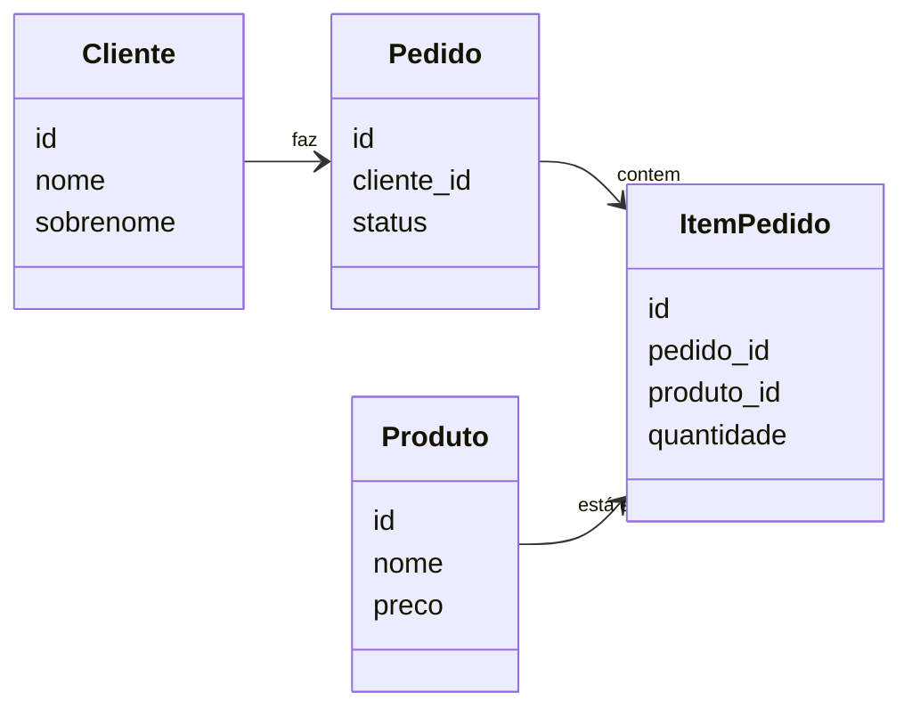

# ORMs - Evitando os erros mais comuns

Como evitar armadilhas ao usar ORMs com Python

---

# O que são ORMs?

### ORM = Object-Relational Mapper: mapeia objetos Python ↔ tabelas/linhas no banco


```python
class Produto(BaseModel):
    url_foto = models.URLField()
    nome = models.CharField(max_length=160)
    descricao = models.TextField()
    valor_unitario = models.DecimalField(
      max_digits=12,
      decimal_places=2,
    )
    ...
```

---

# O que são ORMs?


#### Consultas feitas em código Python...


```python
Produto.objects.filter(
  preco__lte=100,
  data_criacao__gte=date(2026, 1, 1)
).order_by('-data_criacao')
```

<v-click>

...viram código SQL em tempo de execução, automaticamente

```sql
SELECT "id","nome","descricao","preco"
FROM "api_produto"
WHERE ("preco" <= 100
       AND "data_criacao" >= '2026-01-01 00:00:00')
ORDER BY "data_criacao" DESC
```

</v-click>

---
layout: image
image: /image-1.png
backgroundSize: contain
---

---

# Estrutura do nosso sistema



---

# Como funciona Django + DRF

### O fluxo: requisição HTTP → banco → JSON

```
GET /api/pedidos/  (Browser)
    ↓
urls.py (registra rota)
    ↓
view.py (busca dados no BD)
    ↓
serializer.py (formata em JSON)
    ↓
Response JSON
```

---

# Os 3 componentes essenciais

```python
# urls.py - Define rota
path("pedidos/", PedidoListAPIView.as_view())
```

```python {|3}
# views.py - Busca dados (lazy)
class PedidoListAPIView(ListAPIView):
    queryset = Pedido.objects.order_by("-data_criacao")
    serializer_class = PedidoListSerializer
```
```python
# serializers.py - Formata JSON
class PedidoListSerializer(serializers.ModelSerializer):
    cliente_nome = serializers.CharField(source="cliente.nome")
    class Meta:
        model = Pedido
        fields = ["id", "num_pedido", "cliente_nome", "status"]
```

---

# Resultado: JSON estruturado

```json
{
  "results": [
    {
      "id": 1,
      "num_pedido": "PED-001",
      "cliente_nome": "João Silva",
      "status": "entregue"
    },
    {
      "id": 2,
      "num_pedido": "PED-002",
      "cliente_nome": "Maria Santos",
      "status": "aberto"
    }
  ]
}
```
```
```
